# Arquitetura — Diagramas

Diagramas visuais do Open Note em formato Mermaid (renderiza nativamente no GitHub). Complementa o [SYSTEM_DESIGN.md](./SYSTEM_DESIGN.md).

---

## 1. C4 — Contexto do Sistema

Visão mais externa: o Open Note e seus atores/sistemas vizinhos.

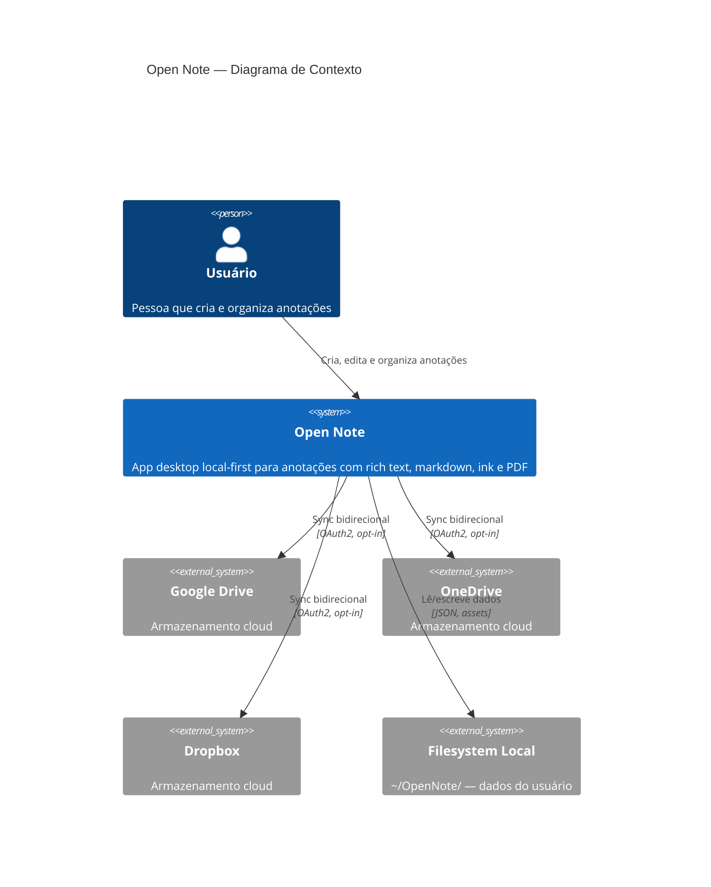

---

## 2. C4 — Containers

Camadas internas da aplicação.

---

## 3. C4 — Componentes do Backend (Rust)

Crates do Cargo workspace e suas dependências.

---

## 4. C4 — Componentes do Frontend (React)

---

## 5. Diagrama de Dependências Cargo

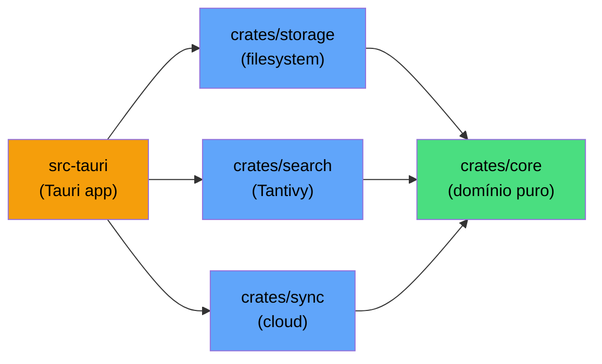

**Regra inviolável:** Setas apontam para dentro. `core` nunca importa nada dos outros crates.

---

## 6. Diagrama ER — Modelo de Domínio

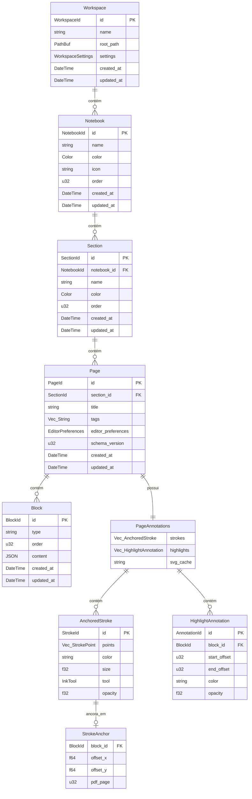

---

## 7. Diagrama de Estado — Ciclo de Vida do App

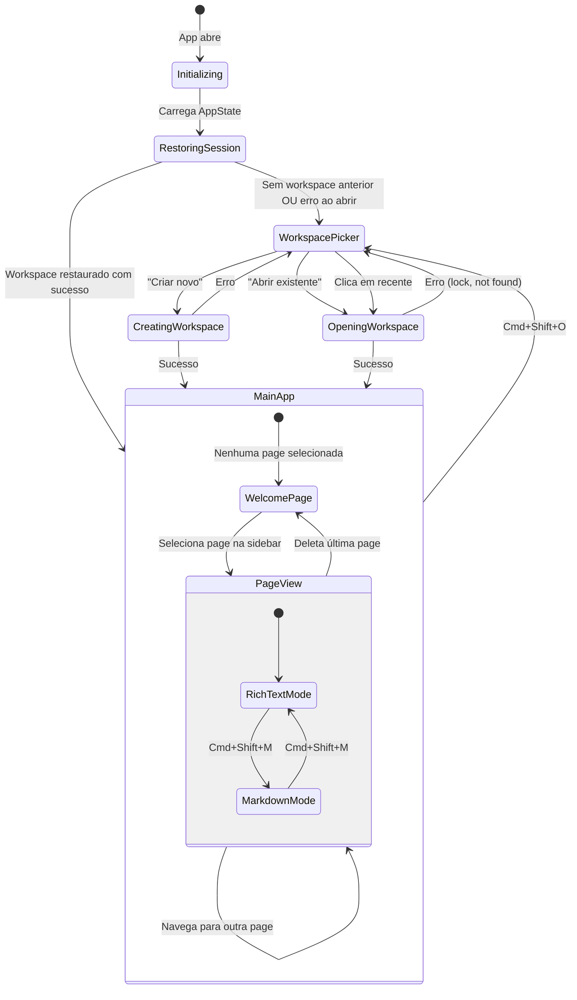

---

## 8. Diagrama de Sequência — Inicialização do App

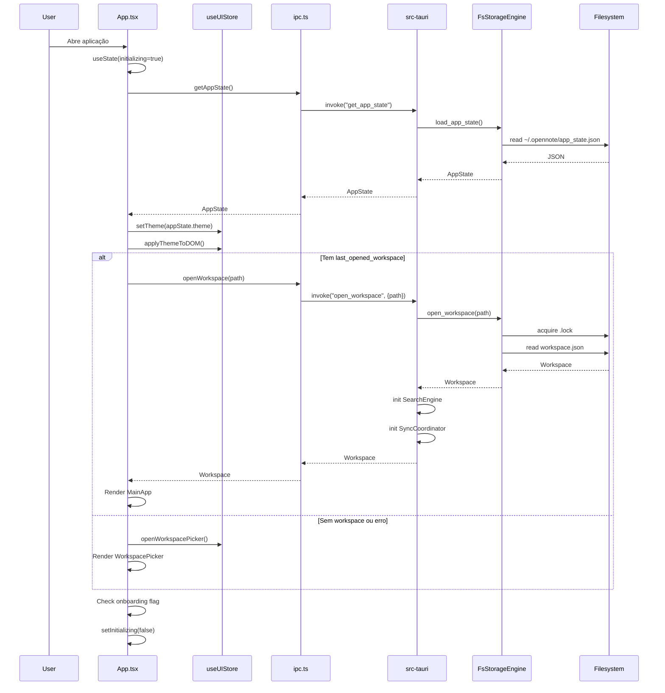

---

## 9. Diagrama de Sequência — Salvar Página (Auto-Save)

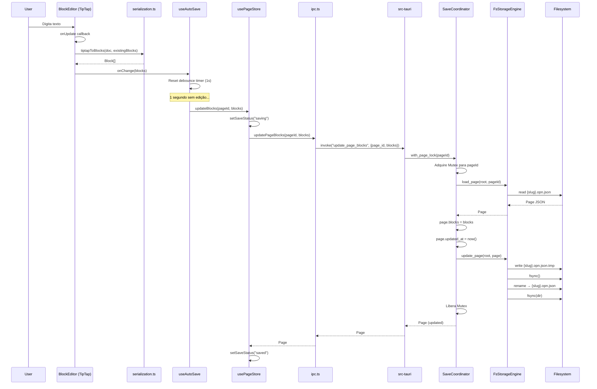

---

## 10. Diagrama de Sequência — Busca Full-Text

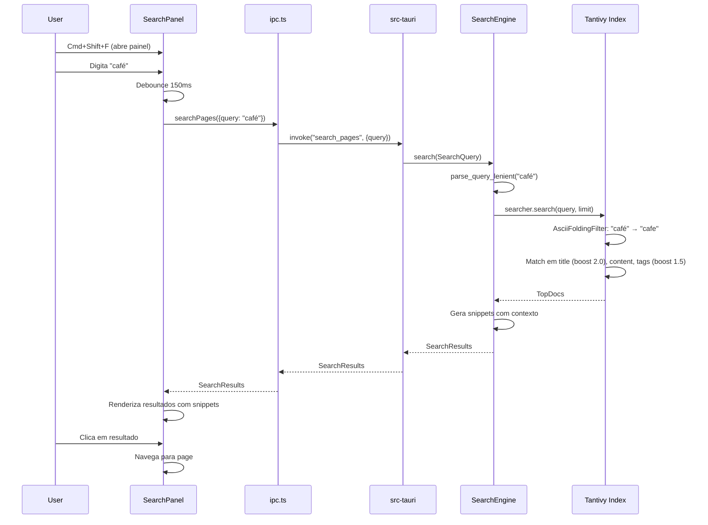

---

## 11. Diagrama de Sequência — Criar Notebook

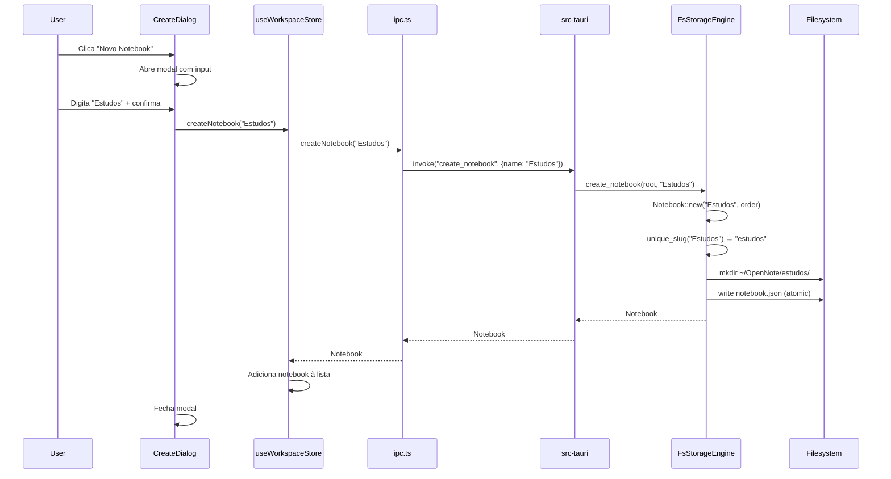

---

## 12. Diagrama de Sequência — Sync (Detecção de Mudanças)

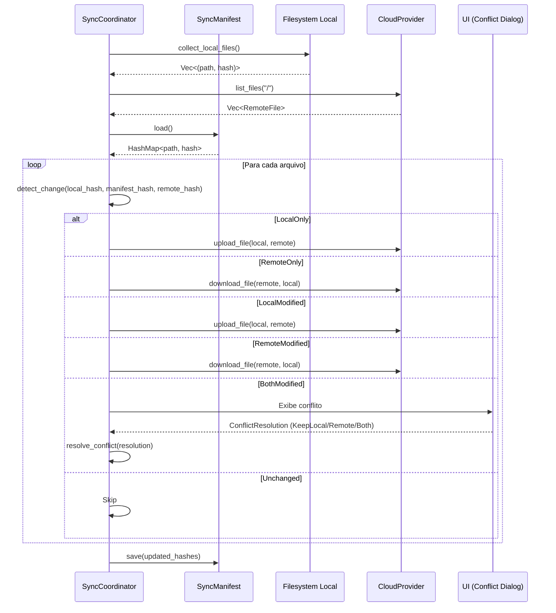

---

## 13. Diagrama de Sequência — Soft Delete e Restore

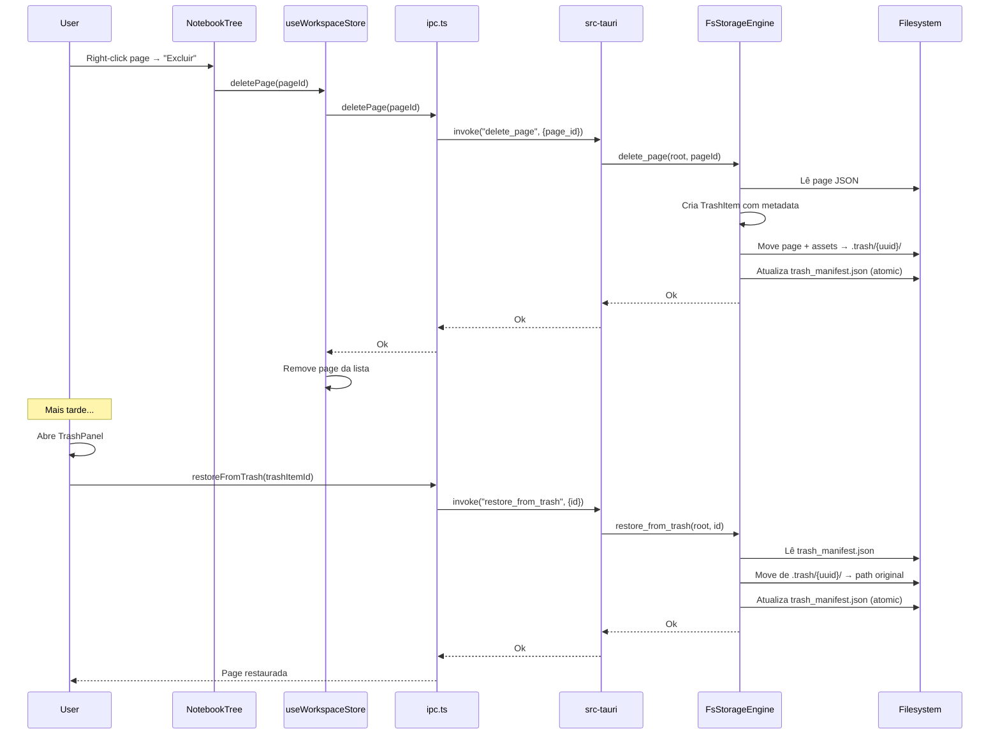

---

## 14. Diagrama de Sequência — Troca de Tema

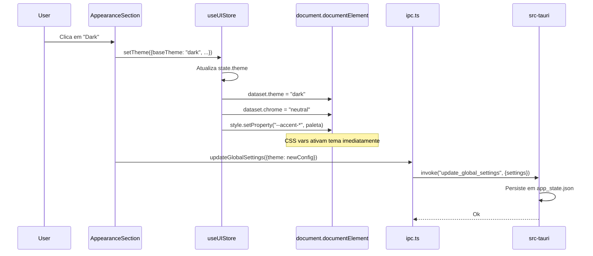

---

## 15. Estrutura de Diretórios do Filesystem

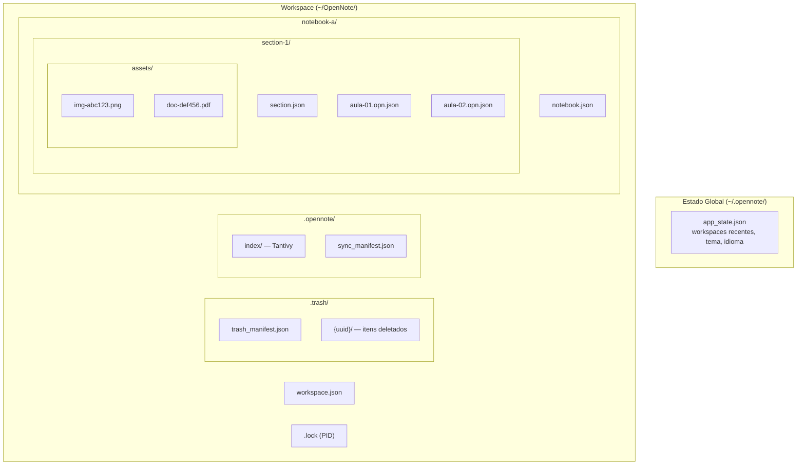

---

## Documentos Relacionados

| Documento | Conteúdo |
|---|---|
| [SYSTEM_DESIGN.md](./SYSTEM_DESIGN.md) | Design do sistema — visão, princípios, modelos |
| [DATA_MODEL.md](./DATA_MODEL.md) | Modelo de dados detalhado com schemas JSON |
| [IPC_REFERENCE.md](./IPC_REFERENCE.md) | Referência completa dos 46 IPC commands |
| [GLOSSARY.md](./GLOSSARY.md) | Glossário DDD — linguagem ubíqua |
