# Architecture — Diagrams

Visual diagrams of Open Note in Mermaid format (renders natively on GitHub). Complements [SYSTEM_DESIGN.md](./SYSTEM_DESIGN.md).

---

## 1. C4 — System Context

Outermost view: Open Note and its actors/neighboring systems.

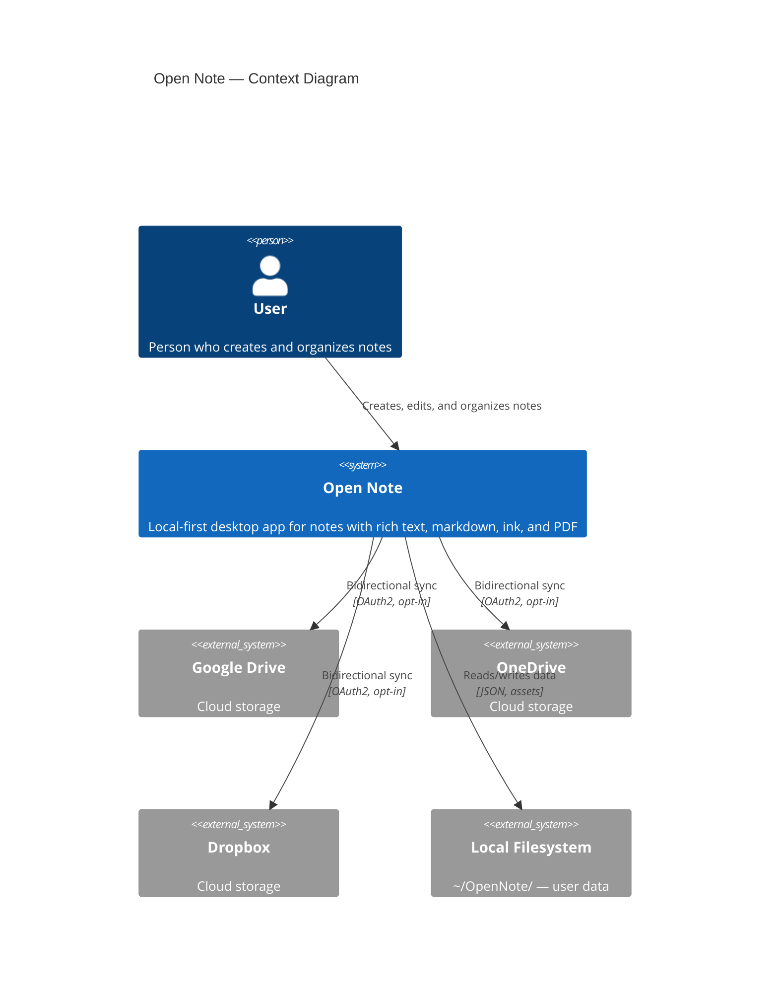

---

## 2. C4 — Containers

Internal layers of the application.

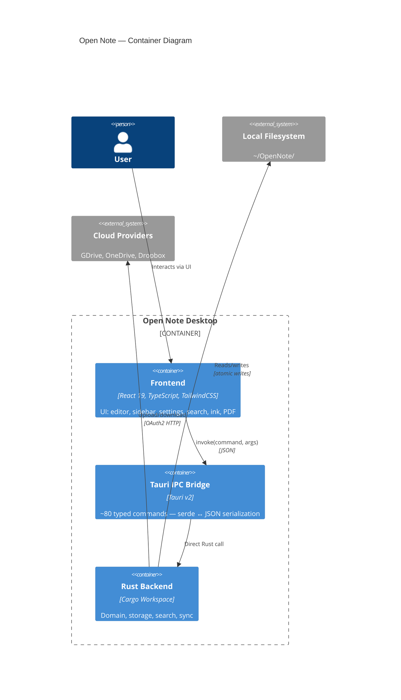

---

## 3. C4 — Backend Components (Rust)

Cargo workspace crates and their dependencies.

```mermaid
graph TB
    subgraph "src-tauri (IPC Layer)"
        commands["commands/<br/>~80 IPC handlers"]
        state["state.rs<br/>AppManagedState<br/>SaveCoordinator"]
    end

    subgraph "crates/storage"
        engine["FsStorageEngine<br/>filesystem CRUD"]
        atomic["atomic.rs<br/>write-tmp-rename-fsync"]
        lock["lock.rs<br/>workspace .lock + PID"]
        slug["slug.rs<br/>Unicode normalization"]
        migrations["migrations.rs<br/>schema v1→v2→..."]
    end

    subgraph "crates/search"
        search_engine["SearchEngine<br/>Tantivy 0.22"]
        schema["schema.rs<br/>custom tokenizer"]
        extract["extract.rs<br/>text extraction"]
    end

    subgraph "crates/sync"
        coordinator["SyncCoordinator<br/>orchestrator"]
        manifest["SyncManifest<br/>SHA-256 hashes"]
        providers["providers/<br/>GDrive, OneDrive, Dropbox"]
    end

    subgraph "crates/core (Pure Domain)"
        entities["Workspace, Notebook<br/>Section, Page, Block"]
        annotations["PageAnnotations<br/>Strokes, Highlights"]
        settings["AppState<br/>GlobalSettings<br/>ThemeConfig"]
        trash["TrashManifest<br/>TrashItem"]
        ids["Newtype IDs<br/>PageId, BlockId..."]
        errors["CoreError"]
    end

    commands --> engine
    commands --> search_engine
    commands --> coordinator
    commands --> state

    engine --> entities
    engine --> trash
    engine --> atomic
    engine --> lock
    engine --> slug
    engine --> migrations

    search_engine --> entities
    search_engine --> extract
    search_engine --> schema

    coordinator --> manifest
    coordinator --> providers

    state --> ids
    state --> search_engine
    state --> coordinator

    style entities fill:#4ade80,color:#000
    style annotations fill:#4ade80,color:#000
    style settings fill:#4ade80,color:#000
    style trash fill:#4ade80,color:#000
    style ids fill:#4ade80,color:#000
    style errors fill:#4ade80,color:#000
```

---

## 4. C4 — Frontend Components (React)

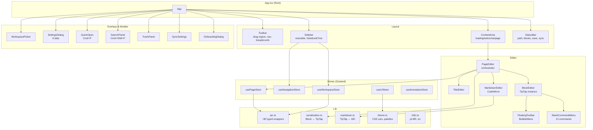

---

## 5. Cargo Dependency Diagram

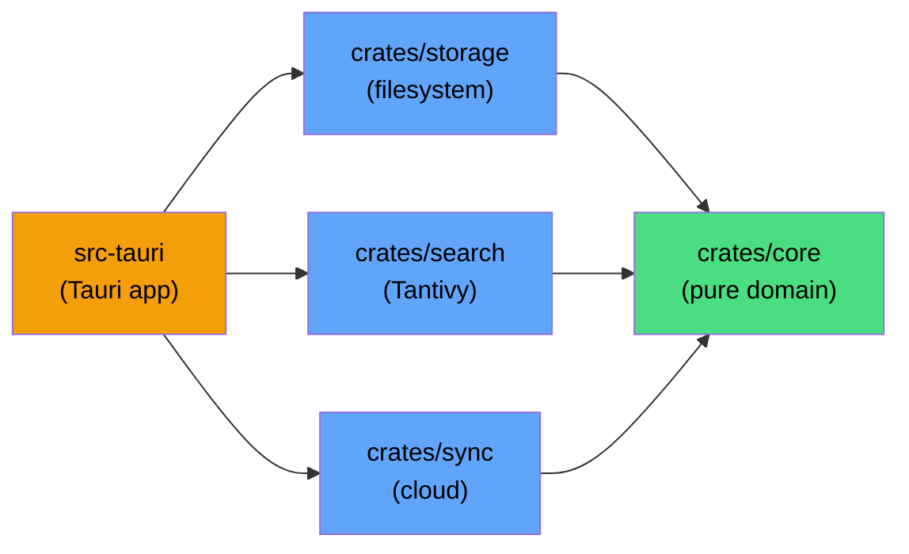

**Inviolable rule:** Arrows point inward. `core` never imports anything from other crates.

---

## 6. ER Diagram — Domain Model

---

## 7. State Diagram — App Lifecycle

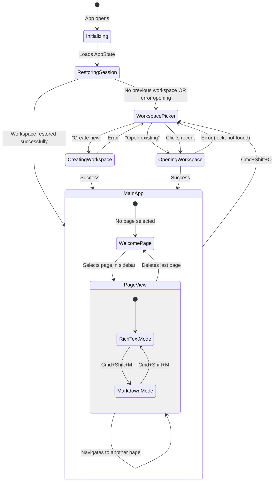

---

## 8. Sequence Diagram — App Initialization

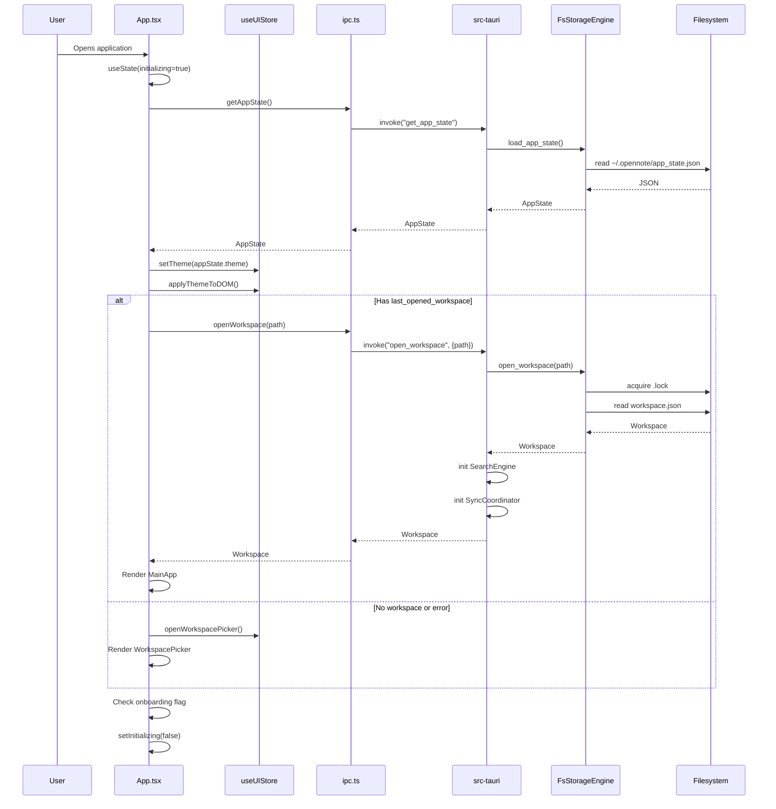

---

## 9. Sequence Diagram — Save Page (Auto-Save)

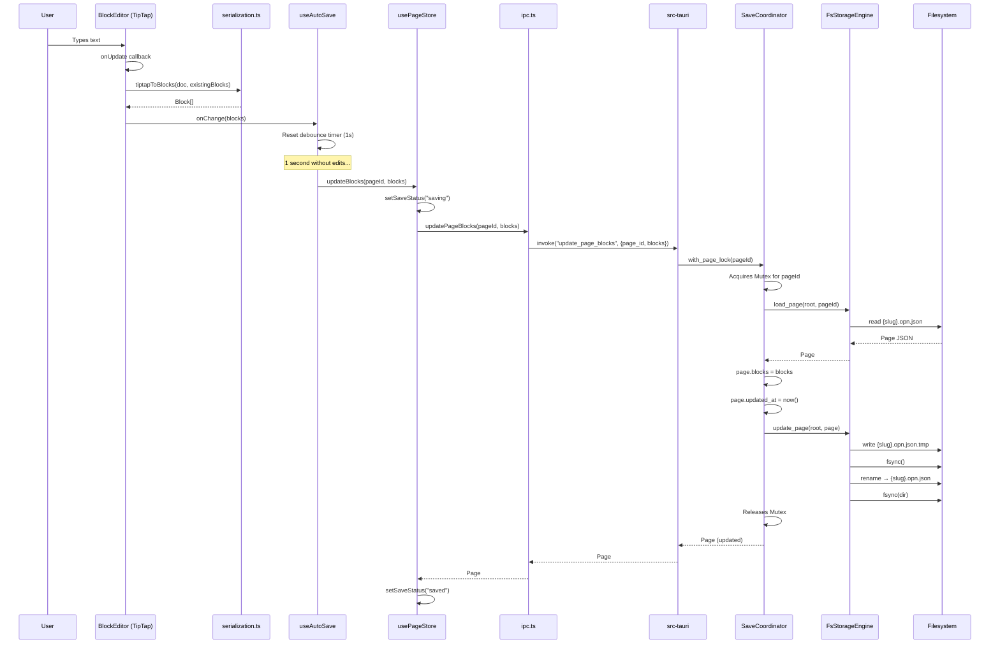

---

## 10. Sequence Diagram — Full-Text Search

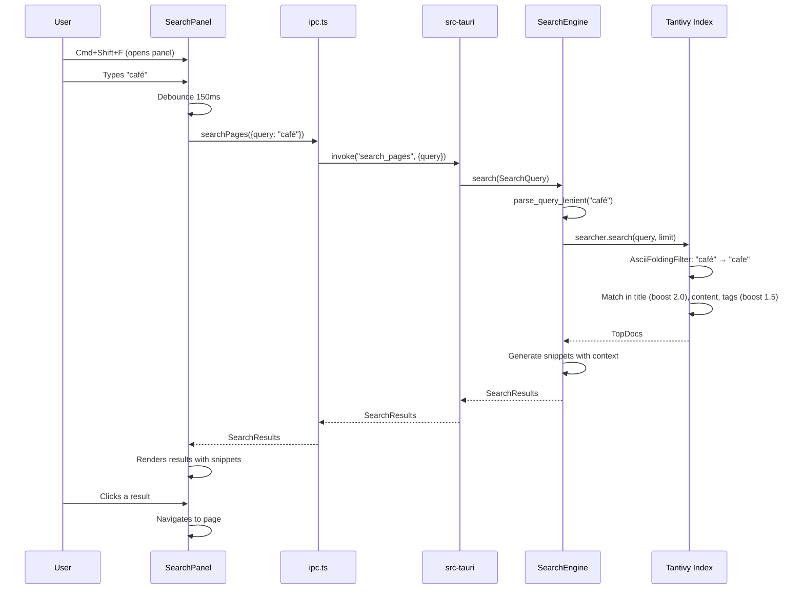

---

## 11. Sequence Diagram — Create Notebook

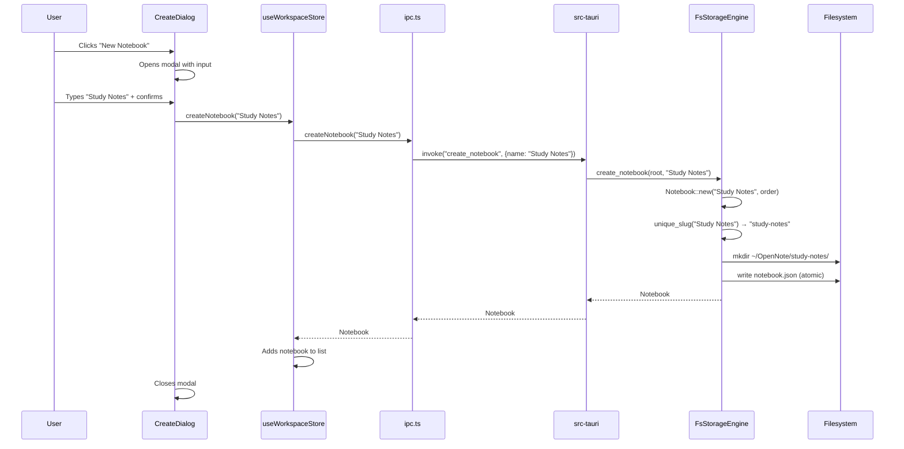

---

## 12. Sequence Diagram — Sync (Change Detection)

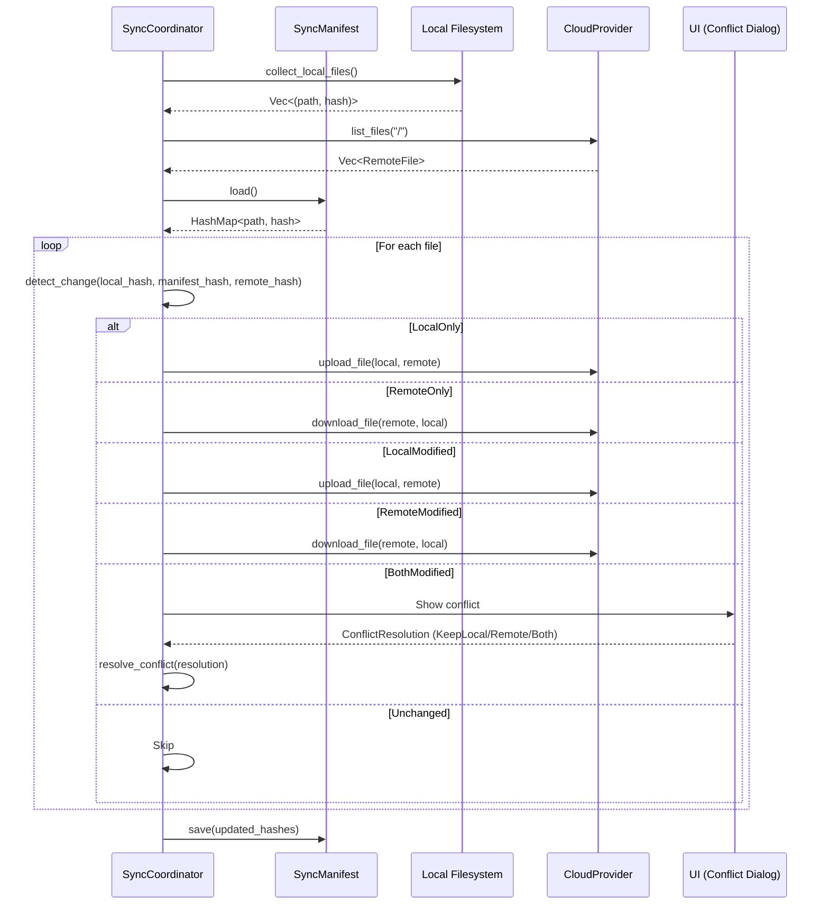

---

## 13. Sequence Diagram — Soft Delete and Restore

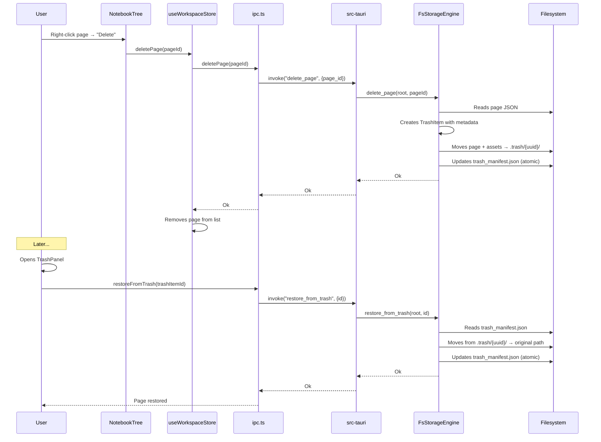

---

## 14. Sequence Diagram — Theme Switch

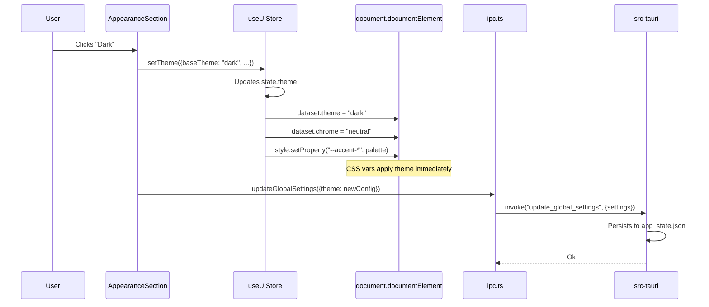

---

## 15. Filesystem Directory Structure

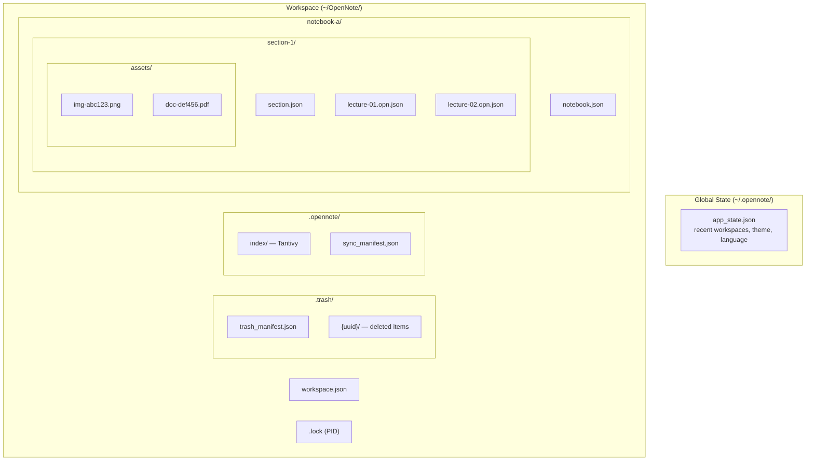

---

## Related Documents

| Document | Content |
|---|---|
| [SYSTEM_DESIGN.md](./SYSTEM_DESIGN.md) | System design — vision, principles, models |
| [DATA_MODEL.md](./DATA_MODEL.md) | Detailed data model with JSON schemas |
| [IPC_REFERENCE.md](./IPC_REFERENCE.md) | Complete IPC command reference |
| [GLOSSARY.md](./GLOSSARY.md) | DDD glossary — ubiquitous language |
