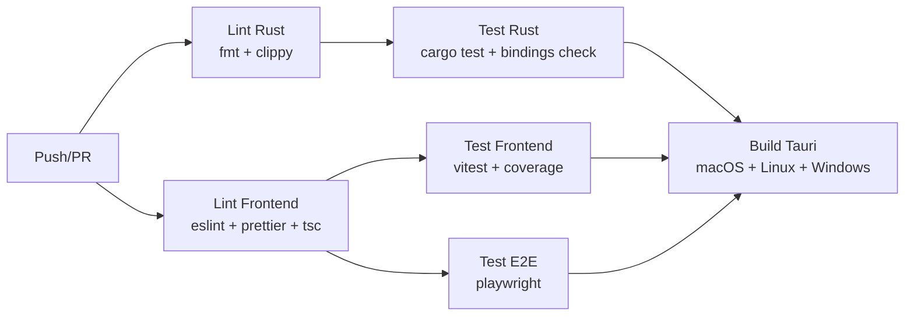

# Testing Strategy — Open Note

Consolidated document covering the test pyramid, tooling, conventions, and coverage targets.

---

## 1. Test Pyramid

```
        ┌──────────┐
        │   E2E    │  Playwright (54 tests)
        │ Journeys │  Chromium + IPC mock
        ├──────────┤
        │Integrat. │  Rust: real filesystem (20 tests)
        │          │  Frontend: stores + IPC mock
        ├──────────┤
        │  Unit    │  Rust: pure domain (95+ tests)
        │          │  Frontend: Vitest + Testing Library (129 tests)
        └──────────┘
```

| Layer | Tools | Scope | Speed |
|---|---|---|---|
| **Unit** | `cargo test`, Vitest | Domain, value objects, stores, hooks, utils | ~ms |
| **Integration** | `cargo test`, Vitest + MSW | Storage with real filesystem, stores + IPC | ~100ms |
| **E2E** | Playwright | Full user journeys in the browser | ~s |

---

## 2. Coverage Targets

| Layer | Target | Command |
|---|---|---|
| **crates/core** (domain) | 90% lines | `cargo test -p opennote-core` |
| **crates/storage** (infra) | 85% lines | `cargo test -p opennote-storage` |
| **crates/search** | 80% lines | `cargo test -p opennote-search` |
| **crates/sync** | 80% lines | `cargo test -p opennote-sync` |
| **Frontend (Vitest)** | 80% lines, 70% branches | `vitest.config.ts → thresholds` |

Frontend coverage excludes (configured in `vitest.config.ts`):
- `src/test/**` — test setup
- `src/**/*.d.ts` — type declarations
- `src/main.tsx` — entry point
- `src/types/bindings/**` — auto-generated
- `src/types/search.ts`, `src/types/sync.ts` — type-only
- `src/components/ink/**`, `src/components/pdf/**` — Canvas/PDF (hard to test with jsdom)
- `src/lib/ink/index.ts` — Canvas API

---

## 3. Rust Tests

### Structure

```
crates/core/src/
├── block.rs          # #[cfg(test)] mod tests { ... }
├── id.rs             # inline tests
├── notebook.rs       # inline tests
├── page.rs           # inline tests
├── section.rs        # inline tests
├── workspace.rs      # inline tests
└── ...

crates/storage/
├── src/              # #[cfg(test)] inline unit tests
└── tests/            # Integration tests (real filesystem)

crates/search/
├── src/              # #[cfg(test)] inline unit tests
└── tests/            # Integration tests (real Tantivy index)
```

### Commands

```bash
# All Rust tests
cargo test --workspace

# Specific crate
cargo test -p opennote-core
cargo test -p opennote-storage
cargo test -p opennote-search
cargo test -p opennote-sync

# Specific test
cargo test -p opennote-core -- page::tests::create_page_with_valid_title

# With output (for debugging)
cargo test -p opennote-core -- --nocapture

# Coverage (requires cargo-tarpaulin)
cargo tarpaulin --workspace --out html
```

### Rust Conventions

- Unit tests **inline** with `#[cfg(test)]` in the same file
- Integration tests in `tests/` (real filesystem, temp dirs)
- JSON snapshots via `insta` crate (where applicable)
- Temp directories via `tempfile` crate
- **Never** depend on global state between tests
- Descriptive names: `fn create_page_rejects_empty_title()`

### What to test in each crate

**core (domain):**
- Entity creation with validation
- JSON serialization/deserialization (serde roundtrip)
- Business rules (block limits, tag normalization, trash expiration)
- Value objects (Color validation, ID uniqueness)

**storage (infra):**
- Full CRUD (create → read → update → delete)
- Atomic writes (file never corrupted)
- Workspace lock (acquire, release, stale detection)
- Slug generation (Unicode, collisions)
- Schema migration pipeline
- Trash lifecycle (soft-delete → restore → permanent delete)
- Asset import/delete

**search:**
- Basic indexing and search
- Text extraction from all block types
- Custom tokenizer (ASCII folding: "café" → "cafe")
- Full rebuild
- Snippets with context

**sync:**
- SHA-256 hashing
- SyncManifest persistence
- Change detection (LocalOnly, RemoteOnly, BothModified, etc.)
- Conflict resolution

---

## 4. Frontend Tests (Vitest)

### Configuration

```typescript
// vitest.config.ts
{
  test: {
    globals: true,
    environment: "jsdom",
    setupFiles: ["./src/test/setup.ts"],
    include: ["src/**/*.{test,spec}.{ts,tsx}"],
  }
}
```

### Setup (`src/test/setup.ts`)

- `@testing-library/jest-dom` matchers
- Mock of `window.__TAURI_INTERNALS__` (IPC)
- Mock of `window.matchMedia` (theme system)
- i18n config import

### Commands

```bash
# Run all
npm run test

# Watch mode
npm run test:watch

# With coverage
npm run test:coverage

# Specific file
npx vitest run src/lib/__tests__/serialization.test.ts
```

### Frontend Conventions

- Test files: `__tests__/FileName.test.ts` or co-located `Component.test.tsx`
- Testing Library: prefer `role`, `text`, `testid` queries (in that order)
- User events via `@testing-library/user-event`
- IPC mocks in global setup
- Assertions with `jest-dom` (`toBeInTheDocument`, `toHaveTextContent`, etc.)

### What to test on the frontend

**Stores (Zustand):**
- Actions and their effects on state
- Reset/cleanup
- IPC interaction (mocked)

**Hooks:**
- `useAutoSave` — debounce, flush, disable
- `useKeyboardShortcuts` — correct binding

**Serialization:**
- `blocksToTiptap()` — Block[] → TipTap JSON conversion
- `tiptapToBlocks()` — conversion back
- Roundtrip (identity)
- Preservation of IDs and non-text blocks

**Theme:**
- Color palettes
- CSS var generation
- DOM application

**Components:**
- Conditional rendering
- User interactions
- Loading/error/empty states

---

## 5. E2E Tests (Playwright)

### Configuration

```typescript
// playwright.config.ts
{
  testDir: "./e2e",
  use: {
    baseURL: "http://localhost:1420",
    locale: "pt-BR",
  },
  webServer: {
    command: "npm run dev",
    url: "http://localhost:1420",
  },
}
```

### Infrastructure

| File | Purpose |
|---|---|
| `e2e/helpers/ipc-mock.ts` | Full mock of IPC commands via `addInitScript` |
| `e2e/helpers/selectors.ts` | Page Object Model with `data-testid` selectors |
| `e2e/helpers/workspace.ts` | Setup helpers: `setupApp`, `setupWithWorkspace`, `setupWithPage` |
| `e2e/fixtures/index.ts` | Realistic test data: notebooks, sections, pages, trash items |

### Approach

- **Vite dev server** (port 1420) — no Tauri binary needed
- **IPC mock** via `page.addInitScript()` intercepts `window.__TAURI_INTERNALS__.invoke`
- Mock is injected **before** React loads
- Per-test overrides via `setupIpcMock(page, { command: customHandler })`

### Commands

```bash
# Run all
npm run test:e2e

# With UI (visual debug)
npx playwright test --ui

# Specific test
npx playwright test e2e/fase-03-ui-shell.spec.ts

# List tests
npx playwright test --list

# Generate report
npx playwright show-report
```

### Test suite

| File | Tests | Scope |
|---|---|---|
| `fase-01-initialization.spec.ts` | 4 | Loading, WorkspacePicker, restore, fallback |
| `fase-02-local-management.spec.ts` | 6 | Create notebook, sidebar tree, trash |
| `fase-03-ui-shell.spec.ts` | 10 | Workspace picker, sidebar, toolbar, shortcuts |
| `fase-04-rich-text-editor.spec.ts` | 4 | Editor, mode toggle, status bar |
| `fase-05-advanced-blocks.spec.ts` | 5 | Code, table, checklist, callout, image |
| `fase-06-markdown-mode.spec.ts` | 3 | Toggle, roundtrip, Cmd+Shift+M |
| `fase-07-ink-pdf.spec.ts` | 3 | Ink block, overlay, PDF block |
| `fase-08-search.spec.ts` | 4 | QuickOpen, SearchPanel, Escape |
| `fase-09-cloud-sync.spec.ts` | 6 | SyncSettings, providers, conflicts |
| `fase-10-settings-themes.spec.ts` | 8 | Settings tabs, theme DOM, chrome tint |

### E2E Conventions

- `data-testid` for stable selectors (never depend on text or CSS classes)
- One file per feature area
- Setup via helpers (don't repeat boilerplate)
- Visual assertions via `expect(locator).toBeVisible()`

---

## 6. CI Pipeline

Defined in `.github/workflows/ci.yml`:



| Job | Runner | Steps |
|---|---|---|
| **lint-rust** | ubuntu-latest | `cargo fmt --check`, `cargo clippy -D warnings` |
| **test-rust** | ubuntu-latest | `cargo test --workspace`, `git diff bindings/` |
| **lint-frontend** | ubuntu-latest | `npm run lint`, `npm run format:check`, `npm run typecheck` |
| **test-frontend** | ubuntu-latest | `npm run test:coverage` |
| **test-e2e** | ubuntu-latest | `npx playwright test` + upload report |
| **build** | macOS, Linux, Windows | `tauri-action@v0` (3 targets) |

Build only runs if **all tests pass**.

---

## 7. Quality Checklist

Before opening a PR:

```bash
# Rust
cargo fmt --check --all
cargo clippy --workspace -- -D warnings
cargo test --workspace

# Frontend
npm run lint
npm run format:check
npm run typecheck
npm run test

# E2E (optional locally — CI runs it)
npm run test:e2e
```

---

## Related Documents

| Document | Content |
|---|---|
| [DEVELOPMENT.md](./DEVELOPMENT.md) | Setup and development guide |
| [BUILD_AND_DEPLOY.md](./BUILD_AND_DEPLOY.md) | Build and distribution |
| [CONTRIBUTING.md](../CONTRIBUTING.md) | Contribution guide |
