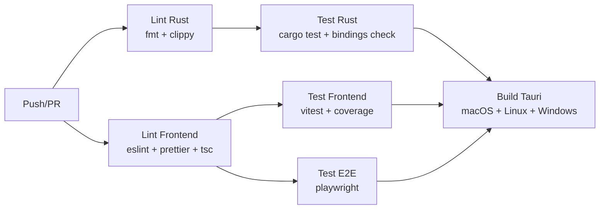

# Estratégia de Testes — Open Note

Documento consolidado sobre a pirâmide de testes, ferramentas, convenções e targets de coverage do projeto.

---

## 1. Pirâmide de Testes

```
        ┌──────────┐
        │   E2E    │  Playwright (54 testes)
        │ Jornadas │  Chromium + IPC mock
        ├──────────┤
        │Integração│  Rust: filesystem real (20 testes)
        │          │  Frontend: stores + IPC mock
        ├──────────┤
        │  Unit    │  Rust: domínio puro (95+ testes)
        │          │  Frontend: Vitest + Testing Library (129 testes)
        └──────────┘
```

| Camada | Ferramentas | Escopo | Velocidade |
|---|---|---|---|
| **Unit** | `cargo test`, Vitest | Domínio, value objects, stores, hooks, utils | ~ms |
| **Integração** | `cargo test`, Vitest + MSW | Storage com filesystem, stores + IPC | ~100ms |
| **E2E** | Playwright | Jornadas completas no browser | ~s |

---

## 2. Coverage Targets

| Camada | Alvo | Configuração |
|---|---|---|
| **crates/core** (domínio) | 90% lines | `cargo test -p opennote-core` |
| **crates/storage** (infra) | 85% lines | `cargo test -p opennote-storage` |
| **crates/search** | 80% lines | `cargo test -p opennote-search` |
| **crates/sync** | 80% lines | `cargo test -p opennote-sync` |
| **Frontend (Vitest)** | 80% lines, 70% branches | `vitest.config.ts → thresholds` |

Frontend coverage exclui (configurado em `vitest.config.ts`):
- `src/test/**` — setup de testes
- `src/**/*.d.ts` — type declarations
- `src/main.tsx` — entry point
- `src/types/bindings/**` — gerado automaticamente
- `src/types/search.ts`, `src/types/sync.ts` — type-only
- `src/components/ink/**`, `src/components/pdf/**` — Canvas/PDF (difíceis de testar com jsdom)
- `src/lib/ink/index.ts` — Canvas API

---

## 3. Testes Rust

### Estrutura

```
crates/core/src/
├── block.rs          # #[cfg(test)] mod tests { ... }
├── id.rs             # inline tests
├── notebook.rs       # inline tests
├── page.rs           # inline tests
├── section.rs        # inline tests
├── workspace.rs      # inline tests
├── settings.rs       # inline tests
├── trash.rs          # inline tests
├── color.rs          # inline tests
├── annotation.rs     # inline tests
└── error.rs          # inline tests

crates/storage/
├── src/              # #[cfg(test)] inline tests
└── tests/            # Testes de integração (filesystem real)

crates/search/
├── src/              # #[cfg(test)] inline tests
└── tests/            # Testes de integração (Tantivy index)
```

### Comandos

```bash
# Todos os testes Rust
cargo test --workspace

# Crate específico
cargo test -p opennote-core
cargo test -p opennote-storage
cargo test -p opennote-search
cargo test -p opennote-sync

# Teste específico
cargo test -p opennote-core -- page::tests::create_page_with_valid_title

# Com output (para debugging)
cargo test -p opennote-core -- --nocapture

# Coverage (requer cargo-tarpaulin)
cargo tarpaulin --workspace --out html
```

### Convenções Rust

- Testes unitários **inline** com `#[cfg(test)]` no mesmo arquivo
- Testes de integração em `tests/` (filesystem real, temp dirs)
- Snapshots JSON via `insta` crate (quando aplicável)
- Temp directories via `tempfile` crate
- **Nunca** depender de estado global entre testes
- Nomes descritivos: `fn create_page_rejects_empty_title()`

### O que testar em cada crate

**core (domínio):**
- Criação de entidades com validação
- Serialização/deserialização JSON (serde roundtrip)
- Regras de negócio (block limits, tag normalization, trash expiration)
- Value objects (Color validation, ID uniqueness)

**storage (infra):**
- CRUD completo (create → read → update → delete)
- Atomic writes (arquivo nunca corrompido)
- Workspace lock (acquire, release, stale detection)
- Slug generation (Unicode, colisões)
- Schema migration pipeline
- Trash lifecycle (soft-delete → restore → permanent delete)
- Asset import/delete

**search:**
- Indexação e busca básica
- Text extraction de todos os block types
- Custom tokenizer (ASCII folding: "café" → "cafe")
- Rebuild completo
- Snippets com contexto

**sync:**
- SHA-256 hashing
- SyncManifest persistence
- Change detection (LocalOnly, RemoteOnly, BothModified, etc.)
- Conflict resolution
- Provider stubs

---

## 4. Testes Frontend (Vitest)

### Configuração

```typescript
// vitest.config.ts
{
  test: {
    globals: true,
    environment: "jsdom",
    setupFiles: ["./src/test/setup.ts"],
    include: ["src/**/*.{test,spec}.{ts,tsx}"],
  }
}
```

### Setup (`src/test/setup.ts`)

- `@testing-library/jest-dom` matchers
- Mock de `window.__TAURI_INTERNALS__` (IPC)
- Mock de `window.matchMedia` (theme system)
- Import de i18n config

### Comandos

```bash
# Rodar todos
npm run test

# Watch mode
npm run test:watch

# Com coverage
npm run test:coverage

# Arquivo específico
npx vitest run src/lib/__tests__/serialization.test.ts
```

### Convenções Frontend

- Arquivos de teste: `__tests__/NomeDoArquivo.test.ts` ou co-located `Componente.test.tsx`
- Testing Library: queries por `role`, `text`, `testid` (nessa ordem de preferência)
- User events via `@testing-library/user-event`
- IPC mocks no setup global
- Assertions com `jest-dom` (`toBeInTheDocument`, `toHaveTextContent`, etc.)

### O que testar no frontend

**Stores (Zustand):**
- Ações e seus efeitos no state
- Reset/cleanup
- Interação com IPC (mock)

**Hooks:**
- `useAutoSave` — debounce, flush, disable
- `useKeyboardShortcuts` — binding correto

**Serialization:**
- `blocksToTiptap()` — conversão Block[] → TipTap JSON
- `tiptapToBlocks()` — conversão de volta
- Roundtrip (identidade)
- Preservação de IDs e non-text blocks

**Theme:**
- Paletas de cores
- Geração de CSS vars
- Aplicação no DOM

**Componentes:**
- Renderização condicional
- Interações de usuário
- Estados de loading/error/empty

---

## 5. Testes E2E (Playwright)

### Configuração

```typescript
// playwright.config.ts
{
  testDir: "./e2e",
  use: {
    baseURL: "http://localhost:1420",
    locale: "pt-BR",
  },
  webServer: {
    command: "npm run dev",
    url: "http://localhost:1420",
  },
}
```

### Infraestrutura

| Arquivo | Função |
|---|---|
| `e2e/helpers/ipc-mock.ts` | Mock completo de 46 IPC commands via `addInitScript` |
| `e2e/helpers/selectors.ts` | Page Object Model com seletores `data-testid` |
| `e2e/helpers/workspace.ts` | Setup helpers: `setupApp`, `setupWithWorkspace`, `setupWithPage` |
| `e2e/fixtures/index.ts` | Dados realistas: notebooks, sections, pages, trash items |

### Abordagem

- **Dev server Vite** (porta 1420) — sem necessidade de build Tauri
- **IPC mock** via `page.addInitScript()` intercepta `window.__TAURI_INTERNALS__.invoke`
- Mock é injetado **antes** do React carregar
- Overrides por teste via `setupIpcMock(page, { command: customHandler })`

### Comandos

```bash
# Rodar todos
npm run test:e2e

# Com UI (debug visual)
npx playwright test --ui

# Teste específico
npx playwright test e2e/fase-03-ui-shell.spec.ts

# Listar testes
npx playwright test --list

# Gerar report
npx playwright show-report
```

### Suíte de testes (54 testes)

| Arquivo | Testes | Escopo |
|---|---|---|
| `fase-01-initialization.spec.ts` | 4 | Loading, WorkspacePicker, restore, fallback |
| `fase-02-local-management.spec.ts` | 6 | Criar notebook, sidebar tree, lixeira |
| `fase-03-ui-shell.spec.ts` | 10 | Workspace picker, sidebar, toolbar, shortcuts |
| `fase-04-rich-text-editor.spec.ts` | 4 | Editor, mode toggle, status bar |
| `fase-05-advanced-blocks.spec.ts` | 5 | Code, table, checklist, callout, image |
| `fase-06-markdown-mode.spec.ts` | 3 | Toggle, roundtrip, Cmd+Shift+M |
| `fase-07-ink-pdf.spec.ts` | 3 | Ink block, overlay, PDF block |
| `fase-08-search.spec.ts` | 4 | QuickOpen, SearchPanel, Escape |
| `fase-09-cloud-sync.spec.ts` | 6 | SyncSettings, providers, conflicts |
| `fase-10-settings-themes.spec.ts` | 8 | Settings tabs, theme DOM, chrome tint |

### Convenções E2E

- `data-testid` para seletores estáveis (não depender de texto ou classes CSS)
- Um arquivo por fase/feature
- Setup via helpers (não repetir boilerplate)
- Assertions visuais via `expect(locator).toBeVisible()`

---

## 6. CI Pipeline

Definido em `.github/workflows/ci.yml`:



| Job | Runner | Passos |
|---|---|---|
| **lint-rust** | ubuntu-latest | `cargo fmt --check`, `cargo clippy -D warnings` |
| **test-rust** | ubuntu-latest | `cargo test --workspace`, `git diff bindings/` |
| **lint-frontend** | ubuntu-latest | `npm run lint`, `npm run format:check`, `npm run typecheck` |
| **test-frontend** | ubuntu-latest | `npm run test:coverage` |
| **test-e2e** | ubuntu-latest | `npx playwright test` + upload report |
| **build** | macOS, Linux, Windows | `tauri-action@v0` (3 targets) |

Build só roda se **todos os testes passam**.

---

## 7. Checklist de Qualidade

Antes de abrir um PR, verificar:

```bash
# Rust
cargo fmt --check --all
cargo clippy --workspace -- -D warnings
cargo test --workspace

# Frontend
npm run lint
npm run format:check
npm run typecheck
npm run test

# E2E (opcional, CI roda)
npm run test:e2e
```

---

## Documentos Relacionados

| Documento | Conteúdo |
|---|---|
| [DEVELOPMENT.md](./DEVELOPMENT.md) | Guia de setup e desenvolvimento |
| [BUILD_AND_DEPLOY.md](./BUILD_AND_DEPLOY.md) | Build e distribuição |
| [CONTRIBUTING.md](../CONTRIBUTING.md) | Guia de contribuição |
